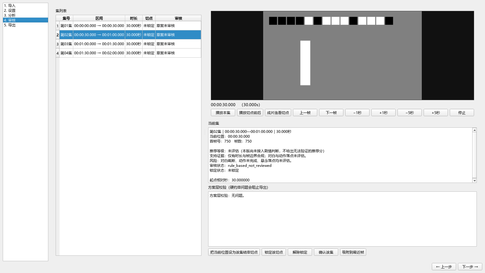

# AI 短剧智能分集器

按《AI短剧智能分集器 V1.2.0 可实施修订方案》落地的桌面工具。
本仓库是**阶段1（媒体与手动分集闭环）的完整实现**，并附阶段2 所需的约束求解与版本机制。

定位：AI 辅助分集、用户审核、程序精确导出。**默认不重排、不补拍、不生成对白。**

## 界面

五页工作流。截图由 `tools/screenshot_gui.py` 离屏渲染真实界面得到，
预览区显示的是 FFmpeg 解出的**真实解码帧**（可见测试素材自带的帧号条码）。

| 页面 | 截图 |
| --- | --- |
| 导入 | [01-导入](docs/screenshots/01-导入.png) |
| 设置 | [02-设置](docs/screenshots/02-设置.png) |
| 分析 | [03-分析](docs/screenshots/03-分析.png) |
| 审核 | [04-审核](docs/screenshots/04-审核.png) |
| 导出 | [05-导出](docs/screenshots/05-导出.png) |
| 模型 | 选择并下载模型（见下节） |



审核页要求「连看切点前后」，因此提供三种检视方式：播放整集、播放切点前后 ±3 秒、
以及**用已导出的成片连看相邻两集**（后者能发现编码层面的衔接问题，前者只能验证规划）。

## 模型下载（界面内完成）

应用内置"模型"页，用户可直接在界面里选择并下载所需模型，**不需要命令行**。

| 类别 | 可选档位 | 用途 |
|---|---|---|
| 语音转写 | whisper tiny / base / small / medium / large-v3 | 对白转写与句末候选 |
| 语义判断 | Qwen3.5-2B / 4B / 9B × 各量化档位（档位列表从远端发现，不写死） | 切点语义判断 |

界面提供：

- **每个模型的实测体积与安装状态**（已安装 / 不完整 / 未安装）；
- **模型目录可更改并记住**（默认 exe/项目根下的 `models/`；环境变量
  `DRAMA_MODELS_DIR` 优先级更高）；
- **磁盘可用空间提示**，下载前再检查一次，空间不足会明确拒绝而不是写到一半失败；
- **实时进度**（按已下载字节），取消后清理临时文件；
- **删除**只删该模型自己的目录。

两类模型相互独立，可只装其一；未安装时对应能力自动跳过并在日志中说明原因。

### 下载链路上的三个硬约束（都是实测踩出来的）

1. **必须用 curl，不能用 Python 的 urllib** —— hf-mirror 会 403 拒绝
   `Python-urllib` 的 User-Agent。
2. **不能用 huggingface_hub 的缓存** —— 它的缓存依赖符号链接，本机账户没有
   该权限，会产出 0 字节占位文件。因此直接下载真实文件到普通目录。
3. **取远端体积必须解析 `Content-Length` 头**，不能用 curl 的
   `%{size_download}` —— HEAD 请求按定义不下载响应体，该值恒为 0，
   表现为"总大小永远未知"、进度条与磁盘预检静默失效。

下载逻辑只有一份实现（`app/core/model_manager.py`），
`tools/fetch_whisper_model.py` 与 `tools/fetch_llm.py` 是它的命令行入口。

## 打包与部署

```bash
# 生成 onedir 产物（默认排除 faster-whisper / scenedetect / llama_cpp 等
# 延迟导入的重型可选依赖，包体从数百 MB 降到几十 MB）
python tools/build_package.py

# 产物自检（无界面，可用于装机验收）
dist/drama-splitter/drama-splitter.exe --self-check    # 运行前提
dist/drama-splitter/drama-splitter.exe --ui-smoke      # 界面完整性
```

`--ui-smoke` 是**必需**的一项：`--self-check` 根本不碰界面，漏打 Qt 插件或
界面模块时它照样"通过"，而用户双击才崩。`--ui-smoke` 会离屏构建整个界面
并走一遍模型页。

自检会逐项报出：FFmpeg / FFprobe 路径、可用的硬件编码器、转写模型、
语义模型与推理栈状态。任一项缺失都给出可操作的下一步命令。

前端目录 `tools/` 下的脚本（素材生成、评测、模型下载）不随包分发，
打包版只包含界面与精确切割所需的运行时。

## 当前实现范围

已完成（可运行、可验证）：

| 方案条款 | 实现位置 | 状态 |
| --- | --- | --- |
| §9.1 真实时间轴（有理数 + 源时间基准整数 ticks） | `app/core/timebase.py`、`probe.py` | 完成 |
| §2.2 / §9.3 媒体探测、VFR/HDR/多音轨/非零 PTS 诊断 | `app/core/probe.py` | 完成 |
| §4 / §5 分集模式、参数规则、可行性与末集处理 | `app/core/settings.py` | 完成 |
| §5.3 剩余时长约束 | `app/core/settings.py::remaining_feasible` | 完成 |
| §9.2 连续覆盖（边界数组 + 共享边界） | `app/core/plan.py` | 完成 |
| §13.3 帧边界吸附与编辑拦截 | `plan.py::snap_to_frames` / `move_boundary` | 完成 |
| §12.3 方案版本、锁定切点、差异比较 | `plan.py`、`app/gui/state.py` | 完成 |
| §14 精确裁切导出、事务式落盘、失败重试 | `app/core/export.py` | 完成 |
| §14.5 计划/视频/边界/音频/时长五层校验 | `export.py::verify_episode_output` | 完成 |
| §12.1/§12.2 缓存：内容指纹、缓存键、一致性 | `app/core/cache.py` | 完成 |
| §7.2 字幕解析、时间合法性、偏移校正 | `app/core/subtitles.py` | 完成 |
| §7.1/§7.3 语音转写、VAD、词级时间、分块偏移 | `app/core/asr.py` | 完成 |
| §8.1 镜头切换与黑场检测 | `app/core/shots.py` | 完成 |
| §8.2/§8.4 候选数据库：收集、合并、评分、限流 | `app/core/candidates.py` | 完成 |
| §13.1 五页工作流界面 | `app/gui/main_window.py` | 完成 |
| §13.3 帧级预览（解码帧驱动，非播放器近似） | `app/gui/frame_source.py` | 完成 |
| §16 阶段1「不依赖 AI 也能正确剪出指定区间」 | 全部 | 验收通过 |
| §16 阶段3「自动基础分析 → 候选数据库」 | `asr/shots/subtitles/candidates/audio/cache` | 验收通过 |
| §6.1 规则草案兜底路径 | `app/core/planner.py` | 完成 |
| §10.1–10.2 候选图 + 动态规划 | `app/core/solver.py` | 完成 |
| §11 语义判断、请求校验、预算与降级 | `app/core/semantic.py` | 完成（模型接口就绪，推理栈待接入） |
| §11 事件索引与整集复核 | `app/core/semantic.py` / `review.py` | 完成 |
| § 三种策略（剧情/悬念/时长） | `solver.py` + `recommend.py` | 完成 |
| §7.2 单集字幕导出（SRT） | `app/core/episode_files.py` | 完成 |
| §14.2 快速复制（关键帧对齐流复制） | `app/core/export.py` | 完成 |
| §12.2 缓存按源失效（重算） | `app/core/cache.py` | 完成 |
| §9.3 完整帧表（VFR 地基） | `app/core/probe.py` | 完成（生成与核验；导出仍要求 CFR） |
| §15 硬件编码器探测 | `app/core/ffmpeg.py` | 完成 |
| § 任务恢复（项目快照） | `app/gui/state.py` | 完成 |
| §15 打包与部署自检 | `tools/build_package.py` + `run.py --self-check` | 完成 |

已知限制（不静默蒙混，都在界面上如实说明）：

- **语义判断当前降级运行**：模型文件（Qwen3.5-2B Q4_K_M）已下载，适配器就绪，
  但本机装不上推理栈（llama-cpp-python 无 cp313 轮子且无编译器，GitHub Release
  资产被代理拦截）。降级时候选保持规则评分、审核状态保持 pending，并在日志里说明
  原因。启动 Ollama 后自动启用，无需改代码。
- **VFR 素材**：完整帧表已可生成与核验，但导出链路仍**要求 CFR**——
  VFR 在导入阶段被识别并拦截在精确导出之外（§9.3），不会静默错位。
- **HDR 转换**：不做，源片 HDR 属性在导入阶段给出警告。
- **快速复制**：要求所有集间切点都落在关键帧上，否则明确拒绝（不静默降级为重新编码）。
  实测关键帧通常每 250 帧（约 10 秒）一个，因此实际可用的切点位置受限。

## 环境

- Windows（其他平台应可运行，未验证）
- Python 3.12+（实测 3.13.14）
- **FFmpeg**（实测 9.0 full build，需含 `libx264` 与 `aac`）
  查找顺序：显式目录 → 环境变量 `DRAMA_FFMPEG_DIR` → `PATH` → 已知安装位置

## 安装与运行

```bash
# 依赖（建议用独立虚拟环境）
python -m venv .venv
.venv/Scripts/python.exe -m pip install -r requirements.txt -i https://pypi.tuna.tsinghua.edu.cn/simple

# 生成合成测试素材（带帧号条码与声音标记）
.venv/Scripts/python.exe tools/make_test_assets.py testdata --seconds 120

# 启动界面
.venv/Scripts/python.exe run.py
```

## 验证

```bash
# 单元与端到端测试（223 项）
.venv/Scripts/python.exe -m pytest tests/ -q

# 界面全链路冒烟（离屏运行，含真实编码与逐帧校验）
.venv/Scripts/python.exe tools/gui_smoke.py
```

### 阶段3 的验证方法

ASR 的正确性无法靠"看起来转出来了"评判，因此引入两套量化手段：

1. **带标准答案的合成语音**：用系统中文 SAPI 引擎（Microsoft Huihui）合成
   已知文本的 10 句对白，并记录每句的精确起止（合成过程即真值）。
   于是可以算 **CER** 与**句起点偏差**。

   实测（small 模型，int8，CPU）：

   | 路径 | 句数 | CER | 起点偏差均值 | 最大 |
   |---|---|---|---|---|
   | 单次转写 | 10/10 | 3.30% | 73ms | 220ms |
   | 分块 12s/3s | 9/10 | 4.40% | 83ms | 220ms |

   分块的代价被量化：CER +1.1pp、漏一个句末、起点偏差 +10ms。
   最大偏差两条路径都是 220ms 且都在第一句——那是 TTS 起音偏软的系统性特征，
   不是分块引入的。

2. **镜头与黑场**：用内联拼接的三段画面验证 ContentDetector，
   用带黑场的合成片段验证 `blackdetect`。

评测工具：`python tools/eval_asr.py small`（输出 CER 与边界误差），
`python tools/make_speech_asset.py testdata`（生成素材）。

### ASR 的三个实测结论

1. **模型必须绕开 huggingface_hub 的缓存机制。**
   本机 Windows 账户没有创建符号链接的权限，而 HF 缓存靠
   `snapshots/<rev>/xxx → ../../blobs/<hash>` 符号链接工作；链接失败时它
   产出 **0 字节占位文件**，而 `blobs/` 里的数据其实是完整下载好的。
   现象是 `model.bin is incomplete`。`local_dir=` 与 `HF_HUB_DISABLE_XET=1`
   都绕不过去，所以 `tools/fetch_whisper_model.py` 用 curl 从 hf-mirror.com
   直接拉真实文件。另外 `huggingface.co` 在本机不可达（HTTP 000 超时）。

2. **ASR 的"句段"边界不是句子边界。**
   10 句对白，small 模型只给 4 个 segment——Whisper 会把连续多句合并。
   因此**候选切点绝不能建立在 segment 边界上**，必须用
   词级时间戳 + 标点 + 静音间隔重建句子（`build_sentences()`）。

3. **繁简转换必须兜底。**
   不加提示词时 Whisper 输出繁体（「這房子你今天必須交出來」）；
   加简体提示词能降到 0，但**不能保证**——实测句尾仍出现
   「那我們就法庭上見。」「隨便你。」。提示词是第一道防线，
   `zhconv` 的确定性转换才是保证。

### 字幕偏移检测的方法选择

§7.2 要求"解析后检查与原声的时间偏移"。第一版用**稠密序列互相关**
（"字幕是否有字" vs "音频是否有声"），实测在短剧对白下几乎失效：
字幕覆盖约 85% 的时间轴，两条稠密序列高度重合，峰值只有 0.24 且
相邻 6 格内几乎完全平坦（0.243 vs 0.241），定位能力极差。
更早一版还把重叠下限设得太松，在极小重叠处刷出 0.984 的**假峰**，
给出 40.9 秒素材偏移 39.85 秒的荒谬结果——而置信度看起来还挺高（0.52）。

改为**事件对齐投票**：语音起始点与字幕起始点都是锐利事件，把每一对
「字幕起点 − 语音起始点」当作对某个偏移的一次投票，票数最高者即所求。
实测四种已知偏移（0 / +1.2 / −0.8 / +3.5 秒）全部还原到 **0.22 秒以内**，
且残留偏差稳定（是起始点检测的系统性滞后，不是随机噪声）——
因此校正门槛设在该滞后之上，避免把检测偏置当成真实错位去"校正"。

### 分块转写为什么要吸附静音

按固定时间点机械切分（0/9/18/27/36s）会让块起点落在词中间，Whisper
看到截断的半截词会产生重复与幻觉——实测出现「不是你你借记得」
「那我们我们就就法庭上上见」这类崩坏文本，词数从 80 涨到 100、
句数从 10 涨到 12。改为把块起点吸附到静音处后，消重改用
**按时间归属**（每个词归给起点不大于它的最后一个块）——因为块起点在静音处、
且上一块终点恒超过下一块起点，重叠区里的词在两块中都是完整的，
于是不需要任何文本匹配，也不会截断。

测试不依赖目测。`tools/markers.py` 在合成素材的每一帧顶部画 14 位二进制条码编码帧序号，
`tools/verify.py` 把帧号从成片里**读回来**，因此每个断言都能指出"第几帧错了"，
而不是"看起来还行"。

## 目录

```
app/core/          引擎（不依赖界面，可独立测试）
  timebase.py        有理数时间与时间基准
  ffmpeg.py          FFmpeg 定位与进程调用
  probe.py           媒体探测、VFR 判定、兼容性诊断
  settings.py        参数规则与可行性检查（§4、§5）
  plan.py            边界方案模型、帧对齐、编辑与版本
  planner.py         规则分集规划器（§6.1 兜底路径）
  export.py          精确裁切导出与产物校验（§14）
  cache.py           内容指纹、缓存键与一致性（§12.2）
  audio.py           音频包络、静音区间、语音起始点
  subtitles.py       字幕解析、时间合法性、偏移校正（§7.2）
  asr.py             语音转写、词级时间戳、分块偏移（§7.1、§7.3）
  shots.py           镜头切换与黑场检测（§8.1）
  candidates.py      候选数据库：收集、合并、评分、限流（§8.2、§8.4）
app/gui/           界面（PySide6-Essentials）
  state.py           项目状态与方案版本链
  workers.py         后台工作线程（探测/规划/导出）
  frame_source.py    帧级预览（单帧解码 + 流式播放）
  main_window.py     五页工作流
tools/             开发与验证工具
  markers.py         帧号条码与声音标记规范
  verify.py          帧号读回、提示音检测、音画偏差测量
  make_test_assets.py 合成素材生成
  make_speech_asset.py 中文语音合成（带 ASR 标准答案）
  eval_asr.py        ASR 评测：CER 与时间戳误差
  fetch_whisper_model.py 下载 whisper 模型（走镜像、绕开符号链接）
  gui_smoke.py       界面全链路冒烟
  diagnose_*.py      切帧行为诊断（下述三个坑的取证过程）
tests/             102 项自动化测试
testdata/          合成素材（不入版本库）
```

## 实测结论汇编

开发过程中发现了三个**只看容器元数据或肉眼看片子发现不了**的问题，
均已在 `SKILL.md` 之外留下取证脚本（`tools/diagnose_seek.py`、`diagnose_seek2.py`、`diagnose_dup.py`）：

1. **`-t` 会在非零起始 PTS 素材上少切最后一帧。**
   `-t` 从首个输出时间戳起算，而 `-ss` 会让输出时间轴平移，
   于是每次都少一帧。已改为只用 `-frames:v N` 控制视频长度。
   在起始 PTS 为 0 的素材上这个错误被完全掩盖。

2. **`-avoid_negative_ts make_zero` 会引入约一帧的音画偏移。**
   它按包时间戳对齐，而 AAC 编码器延迟使包时间戳与解码样本时间戳差 1024 个采样点。
   实测音画偏差从 9.9ms 恶化到 31.2ms。已移除该选项。

3. **校验读取器默认会补帧，制造"帧数不符"的假警报。**
   默认恒定帧率输出策略在首帧 PTS 不为 0 时补帧填充起始空隙。
   已显式加 `-fps_mode passthrough`。

另外修正了两处设计缺陷：

4. `BoundaryPlan.from_seconds` 原先会**静默把末边界改写为片尾**，
   使"调用方漏给一个边界"变成"方案悄悄少一集"且顺利通过全部校验。
   已改为直接报错，并新增语义明确的 `from_interior_cuts`。

5. 可行性检查原先在提前返回的分支里没算可行集数范围，
   界面于是打印出 `可行集数范围：0 – 0 集` / `2 – 1 集` 这类
   把"未计算"当成"计算结果"的假信息。已调整计算顺序并补上可操作的说明文案。

## 验收证据

在 120 秒 / 25fps / 3000 帧的合成素材上，切 4 集（每集 750 帧）：

- 逐帧读回条码，各集帧序列分别为 `0–749`、`750–1499`、`1500–2249`、`2250–2999`
- 四集拼接后**正好等于源片完整序列**（既无重复也无遗漏）
- 每集解码帧数与容器声明一致，均为 750
- 音画偏差 20.1ms（一帧 = 40ms），来自素材自身的 AAC 编码器延迟
- 非法边界移动被阻止且方案未被改动；锁定切点随边界迁移
- 单集字幕：时间相对集起点、跨集句尾截断并记录

阶段5 验收（关键产出物逐项取证）：

- **快速复制**：切点全落在关键帧（0/750/1500/2250 帧）时，4 集各 750 帧全部成功；
  **帧号条码读回**为 0–749 / 750–1499 / 1500–2249 / 2250–2999，零未识破——
  证明拿到的是同一批帧，而不只是帧数对。切点落在非关键帧（第 700 帧）时
  **明确拒绝**并指出是哪个切点，不产出任何集（不降级为重新编码）。
- **帧表**：CFR 素材上帧表与线性映射一致（逐帧核对），关键帧标记与独立探测一致。
- **参数快照**：三种分集模式往返一致；`1/3 + 487/4` 这类分数保持精确，
  不经过 float。
- **缓存失效**：只删除目标素材的条目（其他素材的缓存保留）。
- **硬件兼容**：自检报出 NVIDIA NVENC / Intel QSV / AMD AMF 均被 FFmpeg 列出。
- **打包**：onedir 产物可执行，`--self-check` 在打包版内正确报出运行前提。

阶段3 验收（合成中文语音 10 句，标准答案来自合成过程）：

- 句子重建 10/10（模型只给 4 个 segment，靠词级时间戳重建）
- CER 3.30%（单次）/ 4.40%（分块 12s/3s），起点偏差均值 73/83ms
- 分块与单次转写对照：分块代价 CER +1.1pp、漏 1 个句末、起点偏差 +10ms
- 繁体字符占比 0.0000（提示词 + zhconv 兜底）
- 字幕偏移估计：四种已知偏移（0 / +1.2 / −0.8 / +3.5s）全部还原到 0.22s 内
- 镜头切换与黑场：内联三段画面检出 2.0s/4.0s 两次切换；黑场起止误差 ≤0.3s

§19 的四个演算示例（7200/96–144、5700/120–180→32–47 集、2820/94/75.2–112.8、
7296/121.6/97.28–145.92）与 §5.1、§5.3 的示例均作为断言固化在
`tests/test_settings_and_timebase.py` 中。

## 已知限制

- 快速复制模式未启用（§14.2 允许第一阶段不提供），传入会明确报错而非静默降级
- VFR 素材不做精确导出，仅识别 + 提示（完整帧表属阶段5）
- 界面未做高分屏适配与多语言
- 尚未在真实短剧素材上验证，所有性能与效果结论均基于合成素材
